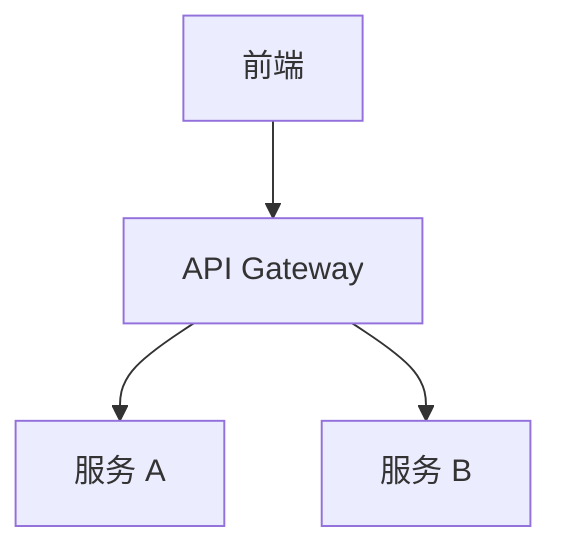
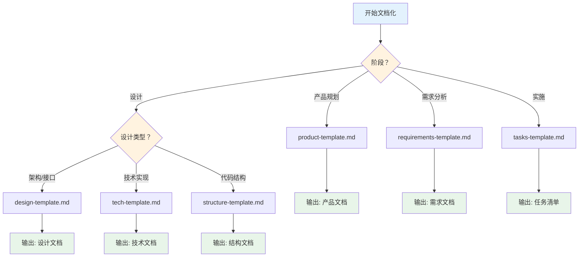

[根目录](../CLAUDE.md) > **.spec-workflow**

---

# Spec Workflow Templates 模块文档

## 变更记录 (Changelog)

### 2025-12-19 10:12:29
- 初始化规范工作流模板模块文档
- 完成模板清单与使用指南
- 生成快速参考

---

## 模块职责

**.spec-workflow** 提供**轻量级的 Markdown 规范模板**，作为 `.bmad-core/templates/` 的补充，适用于快速原型设计和迭代式文档创建。

### 核心功能
- 提供 6 个结构化文档模板
- 支持渐进式需求细化（从产品愿景到任务拆解）
- 无依赖 BMad 代理，可独立使用
- 与 BMad Method 工作流兼容

---

## 入口与启动

### 模板目录结构
```
.spec-workflow/
├── templates/               # 6 个核心模板
│   ├── requirements-template.md
│   ├── design-template.md
│   ├── tasks-template.md
│   ├── product-template.md
│   ├── tech-template.md
│   └── structure-template.md
└── user-templates/          # 用户文档
    └── README.md
```

### 使用方式

#### 方式一：手动复制
```bash
# 复制模板到项目文档目录
cp .spec-workflow/templates/requirements-template.md docs/my-feature-requirements.md
```

#### 方式二：通过 BMad 代理
```bash
# 使用 PM 代理创建文档
/pm 使用 requirements-template 创建"用户认证"需求文档

# 使用 Architect 代理创建架构设计
/architect 使用 design-template 设计"支付网关集成"
```

---

## 对外接口

### 模板清单

| 模板文件 | 用途 | 适用阶段 | 输出示例 |
|---------|------|---------|---------|
| `requirements-template.md` | 功能需求文档 | 需求分析阶段 | `docs/features/user-auth-requirements.md` |
| `design-template.md` | 设计方案文档 | 设计阶段 | `docs/designs/payment-gateway-design.md` |
| `tasks-template.md` | 任务分解清单 | 开发计划阶段 | `docs/tasks/sprint-1-tasks.md` |
| `product-template.md` | 产品文档 | 产品规划阶段 | `docs/product/feature-roadmap.md` |
| `tech-template.md` | 技术文档 | 技术设计阶段 | `docs/tech/database-migration-plan.md` |
| `structure-template.md` | 结构设计文档 | 架构设计阶段 | `docs/architecture/module-structure.md` |

---

## 关键依赖与配置

### 依赖关系
- **无外部依赖**: 可独立使用，不依赖 `.bmad-core/`
- **可选集成**: 与 BMad Method 代理兼容

### 与 BMad Core 的区别

| 特性 | `.spec-workflow/templates/` | `.bmad-core/templates/` |
|------|----------------------------|------------------------|
| **格式** | Markdown | YAML |
| **复杂度** | 轻量级 | 结构化 |
| **用途** | 快速原型、迭代文档 | 标准化流程文档 |
| **代理集成** | 可选 | 强制 |
| **验证** | 无 | 有（通过检查清单） |
| **示例** | 功能需求、设计方案 | PRD、架构文档、QA Gate |

---

## 数据模型

### Requirements Template 结构
```markdown
# [功能名称] 需求文档

## 概述
简要说明功能目标与业务价值。

## 功能需求
### FR-01: [需求标题]
- **描述**: 详细说明
- **优先级**: P0/P1/P2
- **验收标准**:
  - [ ] 标准 1
  - [ ] 标准 2

## 非功能需求
### NFR-01: 性能
- 响应时间 < 200ms
- 支持 1000 并发用户

## 依赖与约束
- 依赖系统 A 的 API v2
- 需在 2025-Q1 完成

## 风险
| 风险 | 概率 | 影响 | 缓解措施 |
|------|------|------|---------|
| API 不稳定 | 中 | 高 | 添加重试机制 |
```

### Design Template 结构
```markdown
# [功能名称] 设计方案

## 设计目标
说明设计要解决的问题与目标。

## 架构设计
### 组件图


### 数据模型
```sql
CREATE TABLE users (
  id UUID PRIMARY KEY,
  email VARCHAR(255) UNIQUE NOT NULL,
  created_at TIMESTAMP DEFAULT NOW()
);
```

## 接口设计
### POST /api/users
- **请求**: `{ email, password }`
- **响应**: `{ id, email, token }`

## 安全考量
- 密码使用 bcrypt 哈希
- JWT Token 过期时间 1 小时

## 测试策略
- 单元测试覆盖核心逻辑
- 集成测试验证 API 端点
```

### Tasks Template 结构
```markdown
# [功能名称] 任务分解

## 任务列表

### 阶段 1: 基础设施
- [ ] Task-01: 搭建数据库 schema
  - **负责人**: @dev-1
  - **预估时间**: 2h
  - **依赖**: 无

- [ ] Task-02: 创建 API 端点
  - **负责人**: @dev-2
  - **预估时间**: 4h
  - **依赖**: Task-01

### 阶段 2: 核心功能
- [ ] Task-03: 实现用户注册逻辑
  - **负责人**: @dev-1
  - **预估时间**: 6h
  - **依赖**: Task-02

## 进度跟踪
- **总任务数**: 10
- **已完成**: 3
- **进行中**: 2
- **待开始**: 5
```

---

## 测试与质量

### 模板质量检查

**完整性检查**
- ✅ 所有 6 个模板文件存在
- ✅ 每个模板包含清晰的章节结构
- ✅ 包含使用示例与占位符

**可用性验证**
```bash
# 检查模板文件是否可读
ls -l .spec-workflow/templates/*.md

# 验证 Markdown 语法
# （推荐使用 markdownlint 工具）
npx markdownlint .spec-workflow/templates/*.md
```

---

## 常见问题 (FAQ)

### Q1: 何时使用 .spec-workflow 模板 vs .bmad-core 模板？
**A**:

**使用 .spec-workflow 模板**：
- 快速原型设计
- 探索性项目
- 小型功能/模块文档
- 需要灵活调整结构
- 独立文档（无需 BMad 代理）

**使用 .bmad-core 模板**：
- 标准化流程项目
- 需要质量门控
- 跨团队协作
- 完整的 PRD/架构文档
- 需要代理验证与检查清单

### Q2: 可以修改模板内容吗？
**A**: 可以。`.spec-workflow/templates/` 提供的是**建议结构**，可以根据项目需求自由调整：
- 添加/删除章节
- 调整格式
- 扩展示例

不会影响 BMad Method 核心功能。

### Q3: 模板是否支持版本控制？
**A**: 是的。建议：
1. 将模板复制到 `docs/` 后纳入版本控制
2. 模板本身（`.spec-workflow/templates/`）可选择性提交
3. 如团队有自定义需求，可在 `.spec-workflow/user-templates/` 中维护

### Q4: 如何与 BMad 代理集成？
**A**: 代理可读取模板并生成文档：
```bash
# 方式一：引用模板路径
/pm 基于 .spec-workflow/templates/requirements-template.md 创建"搜索功能"需求

# 方式二：描述需求，代理自动选择模板
/pm 创建一份功能需求文档，包含验收标准和风险评估
```

### Q5: 为什么有 6 个不同的模板？
**A**: 支持**渐进式文档化**：

1. **product-template.md**: 产品愿景与路线图（最高层）
2. **requirements-template.md**: 功能需求与验收标准（需求层）
3. **design-template.md**: 架构与接口设计（设计层）
4. **tech-template.md**: 技术实现细节（技术层）
5. **structure-template.md**: 模块与代码结构（结构层）
6. **tasks-template.md**: 开发任务与排期（执行层）

从上到下逐步细化，每个层级可独立迭代。

### Q6: 模板支持 Mermaid 图表吗？
**A**: 是的。所有模板都支持 Mermaid 语法：
```markdown

```

需确保 Markdown 查看器支持 Mermaid（VS Code 推荐安装 "Markdown Preview Mermaid Support" 扩展）。

### Q7: 与 BMad Core 的 story-tmpl.yaml 有何关联？
**A**: **无直接关联**。
- `story-tmpl.yaml`（BMad Core）：用于 Sprint 级用户故事
- `.spec-workflow/templates/`：用于功能级/模块级文档

可组合使用：
1. 用 `.spec-workflow/` 设计功能
2. 用 `story-tmpl.yaml` 拆分为可实施的 Story

---

## 相关文件清单

### 模板文件（6 个）
```
templates/
├── requirements-template.md     # 功能需求文档模板
├── design-template.md           # 设计方案文档模板
├── tasks-template.md            # 任务分解清单模板
├── product-template.md          # 产品文档模板
├── tech-template.md             # 技术文档模板
└── structure-template.md        # 结构设计文档模板
```

### 用户文档（1 个）
```
user-templates/
└── README.md                    # 使用指南
```

---

## 快速参考

### 文档创建工作流

**步骤 1: 产品规划**
```bash
# 使用 product-template 定义愿景
cp .spec-workflow/templates/product-template.md docs/product/feature-roadmap.md
```

**步骤 2: 需求分析**
```bash
# 使用 requirements-template 明确需求
cp .spec-workflow/templates/requirements-template.md docs/features/user-auth-requirements.md
```

**步骤 3: 设计方案**
```bash
# 使用 design-template 设计架构
cp .spec-workflow/templates/design-template.md docs/designs/user-auth-design.md
```

**步骤 4: 技术实现**
```bash
# 使用 tech-template 规划技术细节
cp .spec-workflow/templates/tech-template.md docs/tech/jwt-implementation.md
```

**步骤 5: 结构设计**
```bash
# 使用 structure-template 定义模块结构
cp .spec-workflow/templates/structure-template.md docs/architecture/auth-module-structure.md
```

**步骤 6: 任务分解**
```bash
# 使用 tasks-template 拆解任务
cp .spec-workflow/templates/tasks-template.md docs/tasks/auth-sprint-1.md
```

### 模板选择决策树



### 与 BMad Method 集成路径

```
.spec-workflow/templates/
        ↓ (快速原型)
    docs/features/*.md
        ↓ (验证通过)
    BMad PM Agent
        ↓ (生成)
    docs/prd.md
        ↓ (Architect Agent)
    docs/architecture.md
        ↓ (PO Shard)
    docs/prd/*.md + docs/architecture/*.md
        ↓ (SM Agent)
    docs/stories/*.md (Story)
        ↓ (Dev Agent)
    src/ (实施)
        ↓ (QA Agent)
    docs/qa/gates/*.yml (质量门)
```

---

## 最佳实践

### 1. 渐进式细化
不要一次性填满所有章节，分阶段迭代：
- **初稿**: 填充核心章节（概述、主要需求）
- **评审**: 补充细节（验收标准、风险）
- **定稿**: 添加图表、示例

### 2. 模板定制
为团队创建自定义模板变体：
```bash
# 创建团队级模板目录
mkdir .spec-workflow/user-templates/team-templates

# 复制并修改模板
cp .spec-workflow/templates/requirements-template.md \
   .spec-workflow/user-templates/team-templates/api-requirements-template.md
```

### 3. 文档版本化
建议路径结构：
```
docs/
├── features/
│   ├── v1/
│   │   └── user-auth-requirements.md
│   └── v2/
│       └── user-auth-requirements.md
├── designs/
└── tasks/
```

### 4. 链接关联
在文档间建立引用关系：
```markdown
## 相关文档
- [需求文档](../features/user-auth-requirements.md)
- [设计方案](../designs/user-auth-design.md)
- [任务清单](../tasks/auth-sprint-1.md)
```

---

**模块文档版本**: v1.0.0
**最后更新**: 2025-12-19 10:12:29
**模板数量**: 6 个
**依赖**: 无（独立模块）
