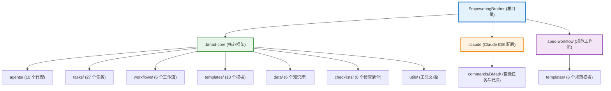

# EmpoweringBrother 项目文档

## 变更记录 (Changelog)

### 2025-12-19 10:12:29
- 初始化项目架构文档
- 完成全仓扫描与模块识别
- 生成项目结构图与模块索引

---

## 项目愿景

**EmpoweringBrother** 是基于 **BMad Method** 框架的 AI 驱动敏捷开发管理系统。该框架提供了一整套结构化的工作流程、代理（Agents）和任务（Tasks），用于从需求分析、架构设计、开发实施到质量保证的全生命周期管理。

### 核心目标
- 通过 AI 代理协作实现高效的产品开发流程
- 提供标准化的开发工作流（Greenfield/Brownfield）
- 支持多种 IDE 集成（Claude Code、OpenCode、Codex 等）
- 实现从规划到交付的可追溯质量管理体系

---

## 架构总览

### 技术栈识别
- **语言**: Markdown（文档）、YAML（配置）
- **框架**: BMad Method v4.44.3
- **IDE 集成**: Claude Code
- **安装时间**: 2025-12-19T02:12:50.085Z

### 系统架构概述
本项目采用**基于角色的多代理协作架构**，通过模板化任务和工作流配置实现标准化的开发流程：

1. **代理层（Agents）**: 模拟不同角色（分析师、产品经理、架构师、开发、QA 等）
2. **任务层（Tasks）**: 可复用的原子化任务模板
3. **工作流层（Workflows）**: 编排任务和代理的标准流程
4. **配置层（Config）**: 项目级配置与 IDE 适配

---

## 模块结构图



---

## 模块索引

| 模块路径 | 职责描述 | 主要内容 | 入口文件 |
|---------|---------|---------|---------|
| `.bmad-core/` | BMad 核心框架 | 代理、任务、工作流、模板、数据 | `core-config.yaml` |
| `.bmad-core/agents/` | AI 代理定义 | 10 个角色代理（PM、Architect、Dev、QA 等） | `bmad-master.md` |
| `.bmad-core/tasks/` | 任务模板库 | 27 个可复用任务（风险评估、测试设计等） | - |
| `.bmad-core/workflows/` | 标准工作流 | Greenfield/Brownfield 的 3 种工作流 | - |
| `.bmad-core/templates/` | 文档模板 | PRD、架构、测试门等 13 个 YAML 模板 | - |
| `.bmad-core/data/` | 知识库 | 测试框架、技术偏好、方法论 | `bmad-kb.md` |
| `.bmad-core/checklists/` | 质量检查清单 | 6 个角色级检查清单 | `po-master-checklist.md` |
| `.claude/commands/BMad/` | Claude IDE 集成 | 镜像 bmad-core 的代理和任务 | - |
| `.spec-workflow/` | 规范工作流补充 | 6 个需求/设计/任务模板 | - |

---

## 运行与开发

### 前置条件
- Node.js ≥ 18
- npm ≥ 9
- Git
- 推荐 IDE: VS Code + Markdown All in One + Mermaid Support

### 快速开始

#### 1. 安装框架
```bash
# 交互式安装（推荐）
npx bmad-method install

# 强制刷新（已安装项目）
npx bmad-method install -f
```

#### 2. IDE 集成

**Claude Code（当前配置）**
- 框架已自动配置到 `.claude/commands/BMad/`
- 使用方式：`/pm`, `/architect`, `/dev`, `/qa` 等

**OpenCode**
```bash
npx bmad-method install -f -i opencode
```

**Codex CLI & Web**
```bash
# 本地开发
npx bmad-method install -f -i codex -d .

# Web 支持（需提交 .bmad-core）
npx bmad-method install -f -i codex-web -d .
```

#### 3. 核心工作流

**规划阶段（Planning）**
1. 分析师（Analyst）：市场调研、竞品分析、项目概要
2. 产品经理（PM）：创建 PRD（产品需求文档）
3. 架构师（Architect）：设计系统架构
4. 产品负责人（PO）：运行主检查清单，确保文档对齐
5. PO：拆分文档（Shard Documents）

**开发阶段（Development）**
1. Scrum Master（SM）：从 Epic 创建 Story
2. QA：高风险 Story 的风险评估与测试设计
3. 开发者（Dev）：实施任务与测试
4. QA：测试架构审查与质量门检查
5. 提交前：确保所有回归测试通过

### 配置文件说明

**核心配置**: `.bmad-core/core-config.yaml`
```yaml
markdownExploder: true
qa:
  qaLocation: docs/qa
prd:
  prdFile: docs/prd.md
  prdVersion: v4
  prdSharded: true
  prdShardedLocation: docs/prd
architecture:
  architectureFile: docs/architecture.md
  architectureVersion: v4
  architectureSharded: true
devLoadAlwaysFiles:
  - docs/architecture/coding-standards.md
  - docs/architecture/tech-stack.md
  - docs/architecture/source-tree.md
slashPrefix: BMad
```

---

## 测试策略

### QA 代理（Test Architect）职责

BMad 的 QA 代理不是简单的代码审查员，而是**测试架构师**，具备：
- 风险评估能力（Risk Profiling）
- 测试策略设计（Test Design）
- 需求追溯验证（Requirements Tracing）
- 非功能性需求评估（NFR Assessment）
- 质量门管理（Quality Gates）

### 核心命令

| 命令 | 阶段 | 用途 | 输出路径 |
|------|------|------|---------|
| `*risk` | Story 草稿后 | 识别实施风险 | `docs/qa/assessments/{epic}.{story}-risk-{date}.md` |
| `*design` | Story 草稿后 | 创建测试策略 | `docs/qa/assessments/{epic}.{story}-test-design-{date}.md` |
| `*trace` | 开发中 | 验证测试覆盖率 | `docs/qa/assessments/{epic}.{story}-trace-{date}.md` |
| `*nfr` | 开发中 | 检查质量属性 | `docs/qa/assessments/{epic}.{story}-nfr-{date}.md` |
| `*review` | Story 完成后 | 全面质量评估 | Story 内 + gate 文件 |
| `*gate` | 修复后 | 更新质量门状态 | `docs/qa/gates/{epic}.{story}-{slug}.yml` |

### 质量标准

- **无不稳定测试**: 通过适当的异步处理确保可靠性
- **无硬等待**: 仅使用动态等待策略
- **无状态 & 并行安全**: 测试独立运行
- **自清理**: 测试管理自己的测试数据
- **适当的测试级别**: Unit（逻辑）/ Integration（交互）/ E2E（用户旅程）
- **显式断言**: 在测试中保持断言，而非帮助函数中

### 质量门状态

- **PASS**: 所有关键需求满足，无阻塞问题
- **CONCERNS**: 发现非关键问题，团队应审查
- **FAIL**: 存在应该解决的关键问题（安全风险、缺失 P0 测试）
- **WAIVED**: 问题已被团队明确接受（需原因、批准人、到期日期）

---

## 编码规范

### 文件组织
- **模板化文档**: 所有模板放在 `.bmad-core/templates/`
- **任务定义**: 遵循 `.bmad-core/tasks/` 中的标准格式
- **代理定义**: 包含 YAML frontmatter 的 Markdown 格式

### 代理交互规范

**依赖系统**
```yaml
dependencies:
  templates:
    - prd-template.md
  tasks:
    - create-doc.md
  data:
    - bmad-kb.md
```

**激活方式**
- Claude Code: `/bmad-master`, `/pm`, `/architect`, `/dev`, `/qa`
- Cursor/Windsurf: `@pm`, `@architect`, `@dev`, `@qa`

### 工作流规范
- **增量模式**: 逐步执行，需用户输入
- **YOLO 模式**: 快速生成，最少交互
- **上下文管理**: 仅保留必要文件在上下文中

---

## AI 使用指引

### 代理角色说明

#### 核心代理
1. **BMad-Master**: 全能代理，可执行除 Story 实施外的所有任务
2. **BMad-Orchestrator**: Web 端重量级代理，协调整个团队（仅用于 Web）
3. **Analyst**: 市场调研、竞品分析、需求挖掘
4. **PM (Product Manager)**: PRD 创建与维护
5. **Architect**: 系统架构设计与技术决策
6. **PO (Product Owner)**: Epic/Story 管理，文档对齐检查
7. **SM (Scrum Master)**: Sprint 计划，Story 创建
8. **Dev**: 代码实施与测试编写
9. **QA**: 测试架构设计与质量保证
10. **UX-Expert**: 前端规范与 UI 设计

### 最佳实践

1. **规划阶段使用 Web UI**
   - 成本更低，上下文更大
   - 使用 Claude Sonnet 4/Opus 或 Gemini 2.5 Pro

2. **开发阶段切换到 IDE**
   - PO 确认文档对齐后进行切换
   - 运行 Shard 任务拆分文档
   - 开始迭代开发

3. **上下文管理**
   - 定期压缩对话历史
   - 每个 Story 完成后开始新对话
   - 携带压缩后的历史作为初始消息

4. **提交频率**
   - 每个 Story 完成后立即提交
   - QA 审查通过后再提交
   - 确保所有回归测试通过

---

## 技术偏好配置

项目支持通过 `.bmad-core/data/technical-preferences.md` 配置技术栈偏好，包括：
- 框架选择（React、Vue、Angular 等）
- 数据库选择（PostgreSQL、MongoDB 等）
- 测试工具（Jest、Vitest、Playwright 等）
- 架构模式（微服务、Monolith、模块化等）

该配置会影响 PM 和 Architect 代理的推荐决策。

---

## 模块详细信息

### 模块: .bmad-core

[根目录](./CLAUDE.md) > **.bmad-core**

#### 模块职责
BMad Method 核心框架，提供完整的 AI 驱动敏捷开发基础设施。

#### 关键组件

**代理（Agents）**
- `bmad-master.md`: 多能代理，可替代其他所有角色
- `bmad-orchestrator.md`: Web 平台团队协调器
- `analyst.md`: 需求分析师
- `pm.md`: 产品经理
- `architect.md`: 系统架构师
- `po.md`: 产品负责人
- `sm.md`: Scrum Master
- `dev.md`: 开发者
- `qa.md`: 测试架构师
- `ux-expert.md`: UX 专家

**任务（Tasks）**
- 风险管理: `risk-profile.md`, `nfr-assess.md`
- 测试设计: `test-design.md`, `trace-requirements.md`
- 文档管理: `shard-doc.md`, `create-doc.md`, `document-project.md`
- 质量保证: `qa-gate.md`, `review-story.md`, `apply-qa-fixes.md`
- Story 管理: `create-next-story.md`, `validate-next-story.md`, `brownfield-create-story.md`
- 其他: `facilitate-brainstorming-session.md`, `generate-ai-frontend-prompt.md`, `kb-mode-interaction.md`

**工作流（Workflows）**
- Greenfield: `greenfield-fullstack.yaml`, `greenfield-service.yaml`, `greenfield-ui.yaml`
- Brownfield: `brownfield-fullstack.yaml`, `brownfield-service.yaml`, `brownfield-ui.yaml`

**模板（Templates）**
- `prd-tmpl.yaml`: 产品需求文档模板
- `architecture-tmpl.yaml`: 架构文档模板
- `story-tmpl.yaml`: 用户故事模板
- `qa-gate-tmpl.yaml`: 质量门模板
- `front-end-spec-tmpl.yaml`: 前端规范模板
- `brownfield-*`: Brownfield 项目专用模板
- 市场调研: `market-research-tmpl.yaml`, `competitor-analysis-tmpl.yaml`

**数据与知识库（Data）**
- `bmad-kb.md`: BMad 方法论知识库
- `test-levels-framework.md`: 测试级别框架
- `test-priorities-matrix.md`: 测试优先级矩阵
- `technical-preferences.md`: 技术偏好配置
- `brainstorming-techniques.md`: 头脑风暴技巧
- `elicitation-methods.md`: 需求挖掘方法

**检查清单（Checklists）**
- `po-master-checklist.md`: PO 主检查清单
- `architect-checklist.md`: 架构师检查清单
- `pm-checklist.md`: PM 检查清单
- `story-draft-checklist.md`: Story 草稿检查清单
- `story-dod-checklist.md`: Story 完成定义检查清单
- `change-checklist.md`: 变更管理检查清单

#### 配置与文档
- `core-config.yaml`: 核心配置文件
- `user-guide.md`: 用户指南（578 行）
- `working-in-the-brownfield.md`: Brownfield 项目指南
- `enhanced-ide-development-workflow.md`: 增强 IDE 开发工作流

#### 常见问题
**Q: 如何选择代理？**
A: 简单任务用 BMad-Master，复杂流程按角色分工使用专门代理。

**Q: Greenfield 与 Brownfield 的区别？**
A: Greenfield 为新项目，Brownfield 为现有项目改造，后者需额外的遗留系统评估。

---

### 模块: .claude

[根目录](./CLAUDE.md) > **.claude**

#### 模块职责
Claude Code IDE 集成配置，通过 `/` 命令激活 BMad 代理和任务。

#### 关键内容
- `commands/BMad/agents/`: 镜像 `.bmad-core/agents/` 的 10 个代理
- `commands/BMad/tasks/`: 镜像 `.bmad-core/tasks/` 的 27 个任务

#### 使用方式
```bash
/pm 创建一个任务管理应用的 PRD
/architect 设计系统架构
/dev 实现用户认证功能
/qa *review {story-id}
```

---

### 模块: .spec-workflow

[根目录](./CLAUDE.md) > **.spec-workflow**

#### 模块职责
补充的规范工作流模板，提供额外的结构化文档模板。

#### 关键模板
- `requirements-template.md`: 需求文档模板
- `design-template.md`: 设计文档模板
- `tasks-template.md`: 任务分解模板
- `product-template.md`: 产品文档模板
- `tech-template.md`: 技术文档模板
- `structure-template.md`: 结构设计模板

#### 常见问题
**Q: 与 .bmad-core/templates 的区别？**
A: .spec-workflow 提供更轻量级的 Markdown 模板，适合快速原型设计。

---

## 覆盖率报告

### 扫描统计
- **总文件数**: 115 个
- **已扫描文件数**: 115 个
- **覆盖率**: 100%
- **扫描时间**: 2025-12-19 10:12:29

### 文件分布
| 类型 | 数量 | 占比 |
|------|------|------|
| Markdown (.md) | 91 | 79.1% |
| YAML (.yaml) | 24 | 20.9% |
| 其他 | 0 | 0% |

### 目录结构
```
EmpoweringBrother/
├── .bmad-core/          (93 文件)
│   ├── agents/          (10 文件)
│   ├── tasks/           (27 文件)
│   ├── workflows/       (6 文件)
│   ├── templates/       (13 文件)
│   ├── data/            (6 文件)
│   ├── checklists/      (6 文件)
│   ├── utils/           (2 文件)
│   ├── agent-teams/     (4 文件)
│   └── 配置与文档        (19 文件)
├── .claude/             (20 文件)
│   └── commands/BMad/   (代理+任务镜像)
└── .spec-workflow/      (7 文件)
    └── templates/       (6 文件)
```

### 模块完整度评估

#### .bmad-core (完整度: 100%)
- ✅ 入口文件: `core-config.yaml`
- ✅ 代理定义: 10/10 完整
- ✅ 任务库: 27/27 完整
- ✅ 工作流: 6/6 完整
- ✅ 模板: 13/13 完整
- ✅ 知识库: 6/6 完整
- ✅ 文档: 完整（user-guide, brownfield-guide, workflow-guide）

#### .claude (完整度: 100%)
- ✅ 代理集成: 10/10 完整
- ✅ 任务集成: 27/27 完整
- ✅ 与 .bmad-core 同步

#### .spec-workflow (完整度: 100%)
- ✅ 规范模板: 6/6 完整
- ✅ README: 存在

### 缺失项与建议

#### 当前无缺失项
项目结构完整，所有模块均已正确安装。

#### 后续建议
1. **创建项目文档目录**: 根据 `core-config.yaml` 配置，建议创建：
   - `docs/prd.md` 或 `docs/prd/` (PRD 文档)
   - `docs/architecture.md` 或 `docs/architecture/` (架构文档)
   - `docs/qa/` (QA 评估与质量门)
   - `docs/stories/` (用户故事)

2. **初始化源代码目录**: 如果开始开发，建议创建：
   - `src/` (源代码)
   - `tests/` (测试代码)
   - `package.json` (如使用 Node.js)

3. **配置 Git 忽略**: 虽然未找到 `.gitignore`，但建议添加：
   ```
   node_modules/
   .env
   .DS_Store
   dist/
   build/
   *.log
   ```

4. **自定义技术偏好**: 编辑 `.bmad-core/data/technical-preferences.md` 以匹配团队技术栈。

5. **配置开发者上下文文件**: 完善 `devLoadAlwaysFiles` 列表，确保架构碎片文档存在：
   - `docs/architecture/coding-standards.md`
   - `docs/architecture/tech-stack.md`
   - `docs/architecture/source-tree.md`

---

## 下一步行动建议

### 立即可执行
1. ✅ 项目结构文档已生成 (`CLAUDE.md`)
2. ✅ 模块索引已完成
3. ⚠️ 创建 `.claude/index.json` 元数据文件
4. ⚠️ 创建 `docs/` 目录并初始化基础文档结构

### 开始开发前
1. 运行 `/pm` 或 `@pm` 创建 PRD
2. 运行 `/architect` 设计系统架构
3. 运行 `/po` 执行主检查清单
4. 运行 `/po *shard` 拆分 PRD 和架构文档

### 持续改进
1. 定期更新 `technical-preferences.md`
2. 每个 Sprint 后回顾 QA 报告
3. 维护团队级编码标准文档
4. 使用 `bmad-method install -f` 更新框架

---

## 相关资源

### 官方文档
- [BMad Method GitHub](https://github.com/bmadcode/bmad-method)
- [用户指南](./.bmad-core/user-guide.md)
- [Brownfield 指南](./.bmad-core/working-in-the-brownfield.md)

### 社区支持
- [Discord 社区](https://discord.gg/gk8jAdXWmj)
- [YouTube 频道](https://www.youtube.com/@BMadCode)
- [GitHub Issues](https://github.com/bmadcode/bmad-method/issues)

### 关键配置文件
- [核心配置](./.bmad-core/core-config.yaml)
- [安装清单](./.bmad-core/install-manifest.yaml)
- [技术偏好](./.bmad-core/data/technical-preferences.md)

---

**文档生成信息**
- 版本: BMad Method v4.44.3
- 生成时间: 2025-12-19 10:12:29
- IDE: Claude Code
- 覆盖率: 100% (115/115 文件)
